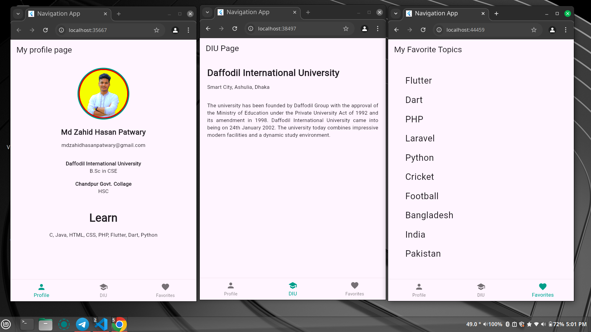

# Personal Portfolio App

## Overview
This is a simple personal portfolio app designed using Flutter. The app features three main pages: My Profile, DIU Page, and Favorites Page, allowing users to navigate easily through various sections of the portfolio. The app utilizes Flutter's BottomNavigationBar for navigation and incorporates several UI components to create an appealing layout.

## Objectives
The primary objective of this project was to:
- Practice basic navigation in Flutter using the BottomNavigationBar.
- Utilize Flutter widgets such as `CircularAvatar`, `Container`, `Column`, and `ListView` to create a functional and visually pleasing app.
- Get comfortable with Flutter's widget system and routing.

## Features
- **Three Pages**: The app consists of three pages:
  - **My Profile**: Displays the user's profile information, including a profile picture and educational background.
  - **DIU Page**: Provides information about Daffodil International University.
  - **Favorites Page**: Lists the user's favorite topics in a scrollable list.
- **Smooth Navigation**: Users can navigate between pages seamlessly using the BottomNavigationBar.
- **Responsive Design**: The app adapts to different screen sizes and orientations.

## Technologies Used
- **Flutter**: The primary framework used to build the app.
- **Dart**: The programming language used in Flutter development.

## Installation
To run this project locally, follow these steps:

1. Clone the repository:
   ```bash
   git clone <repository-url>
   ```

2. Navigate to the project directory:
   ```bash
   cd portfolio_app
   ```

3. Install dependencies:
   ```bash
   flutter pub get
   ```

4. Run the app:
   ```bash
   flutter run
   ```

## Code Structure
The main components of the app are as follows:

- `main.dart`: The entry point of the app that sets up the `BottomNavigationBar` and manages the state of the selected index.
- `myprofile_page.dart`: Contains the `MyProfilePage` class that displays user profile information.
- `diu_page.dart`: Contains the `DIUPage` class that displays information about Daffodil International University.
- `favorites_page.dart`: Contains the `FavoritesPage` class that lists the user's favorite topics.

## Screenshots


## Conclusion
The portfolio app demonstrates a solid understanding of Flutter basics, including widget usage, navigation, and layout design. The app is functional, and the UI components work harmoniously together to create a polished user experience. Future enhancements may include adding animations or integrating a backend service.

## Author
**Md Zahid Hasan Patwary**  

Feel free to modify any sections or add additional details as needed!
