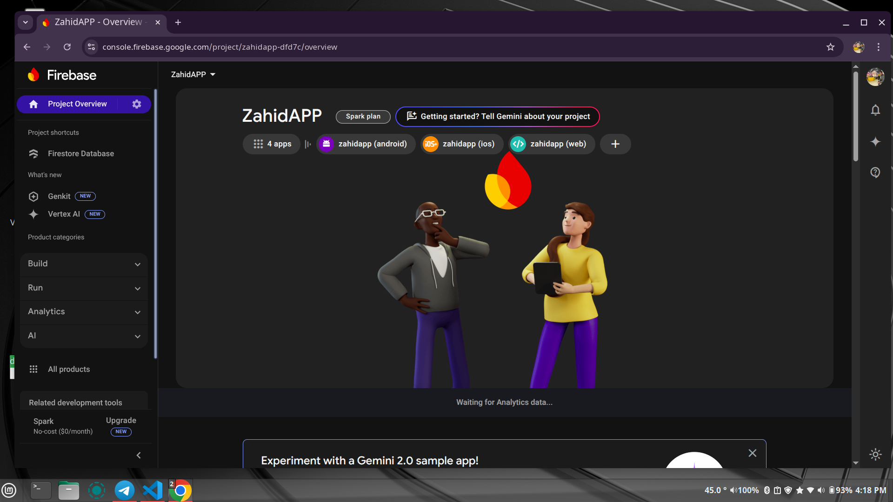

# Integration of Firebase into a Flutter Project

## Overview
This project demonstrates the integration of Firebase, a comprehensive backend-as-a-service platform, into a Flutter application. By leveraging Firebase's features such as real-time databases, user authentication, cloud storage, and push notifications, the app enhances its functionality, scalability, and interactivity while maintaining a straightforward development process.

## Objectives
- Integrate Firebase services into a Flutter application.
- Enable functionalities like real-time databases, user authentication, cloud storage, and push notifications.
- Simplify the development process while enhancing app capabilities.

## Prerequisites
- Flutter SDK installed on your machine.
- Firebase account and access to the Firebase Console.

## Setup Instructions

### 1. Initialize the Flutter Project
Create a new Flutter project by running the following command in your terminal:
```bash
flutter create my_app
```
This command generates the necessary structure and files for a functional Flutter application.

### 2. Create a Firebase Project
1. Navigate to the [Firebase Console](https://console.firebase.google.com).
2. Create a new project named **MyFlutterApp** and follow the guided setup instructions.

### 3. Integrate Firebase into the App
After creating the Firebase project, download the configuration files:
- For **Android**, place the `google-services.json` file inside the `android/app/` directory.
- For **iOS**, add the `GoogleService-Info.plist` file to the `ios/Runner/` directory.

These files establish the connection between the Firebase backend and the Flutter application.

### 4. Update Flutter Configuration
Add the required Firebase dependencies to your `pubspec.yaml` file:
```yaml
dependencies:
  firebase_core: ^latest_version
  cloud_firestore: ^latest_version
```
Then, run the following command to install the packages:
```bash
flutter pub get
```

### 5. Code Implementation
Here is the implementation of the `main.dart` file:
```dart
import 'package:applicationlab/firebase_options.dart';
import 'package:firebase_core/firebase_core.dart';
import 'package:flutter/material.dart';

void main() async {
  WidgetsFlutterBinding.ensureInitialized();
  await Firebase.initializeApp(
    options: DefaultFirebaseOptions.currentPlatform,
  );
  runApp(const MyApp());
}
```

## Commands Used
- **Create Flutter Project:**
  ```bash
  flutter create navigation_app
  ```

- **Run the Flutter App:**
  ```bash
  flutter run
  ```

- **Install FlutterFire CLI:**
  ```bash
  dart pub global activate flutterfire_cli
  ```

- **Configure Firebase Project:**
  ```bash
  flutterfire configure --project=zahidapp-dfd7c
  ```

## Output
The successful integration of Firebase services into the Flutter application, enabling functionalities such as real-time data updates, user authentication, and cloud storage.

## Screenshots


## Conclusion
The integration of Firebase into a Flutter application is a streamlined process that significantly enhances the app's capabilities. The well-defined steps and clear guidelines facilitate a smooth setup, allowing developers to focus on building robust applications without unnecessary complexity. This project lays the groundwork for scalable app development using Flutter and Firebase, setting the stage for future enhancements and features.


Have a good day!
